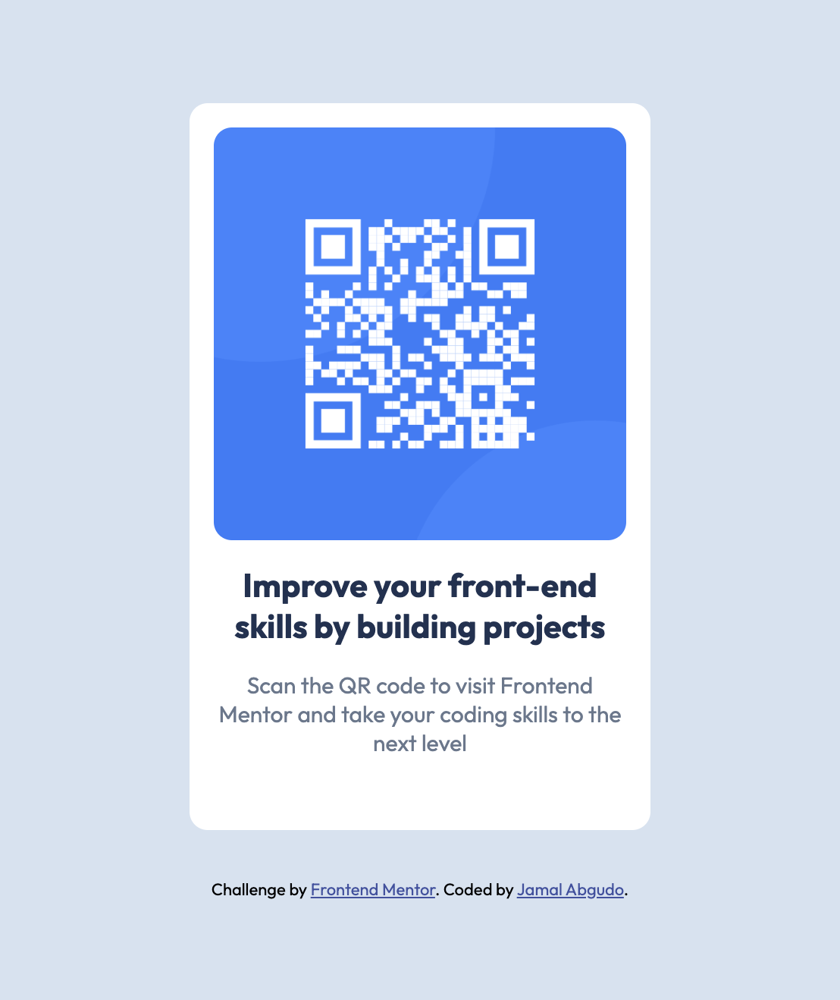

# Frontend Mentor - QR code component solution

This is a solution to the [QR code component challenge on Frontend Mentor](https://www.frontendmentor.io/challenges/qr-code-component-iux_sIO_H). Frontend Mentor challenges help you improve your coding skills by building realistic projects.

## Table of contents

- [Overview](#overview)
  - [Screenshot](#screenshot)
  - [Links](#links)
- [My process](#my-process)
  - [Built with](#built-with)
  - [What I learned](#what-i-learned)
  - [Continued development](#continued-development)
  - [Useful resources](#useful-resources)
- [Author](#author)
- [Acknowledgments](#acknowledgments)

## Overview

### Screenshot



### Links

- Live Site URL: [qrcode-solution](https://qrcode-done.netlify.app/)

## My process

### Built with

- Semantic HTML5 markup
- CSS custom properties
- Flexbox
- Mobile-first workflow

### What I learned

I learnt how to start use custom properties and how to avoid margin collapse issues in block formatting context.
The example below shows how to remove margins and introduce custom spacing between contents the same way gap css rule works for Flexbox.

```css
h1,
p {
  margin: 0;
}

.flow-content > * + * {
  margin-top: 1rem;
}
```

### Continued development

I used netlify to host the app and test it.

## Author

- Frontend Mentor - [Jamal Guyo](https://www.frontendmentor.io/profile/JamalGuyo)
